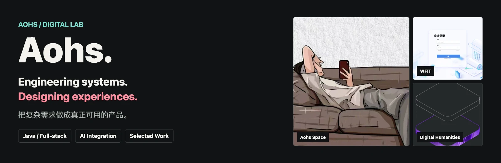
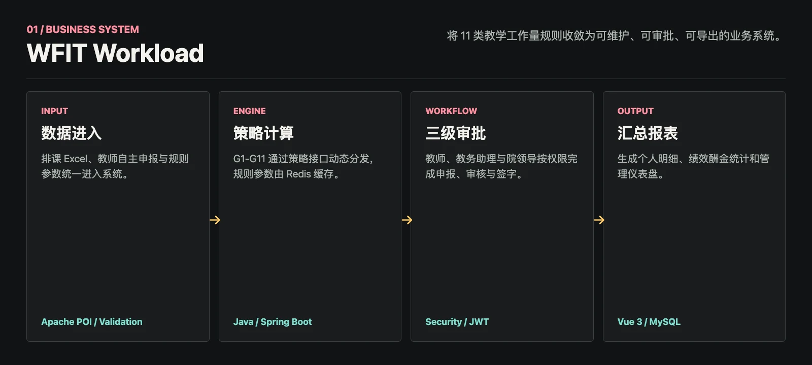
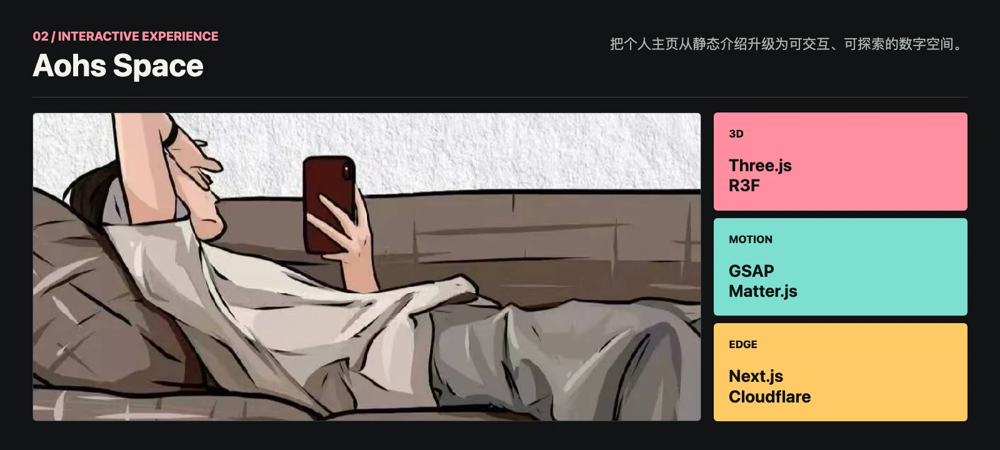
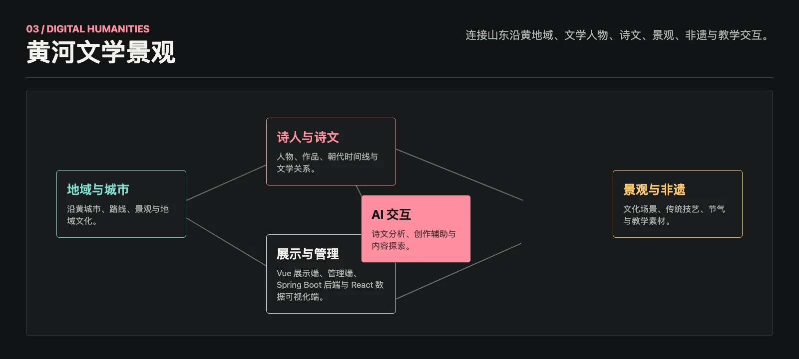
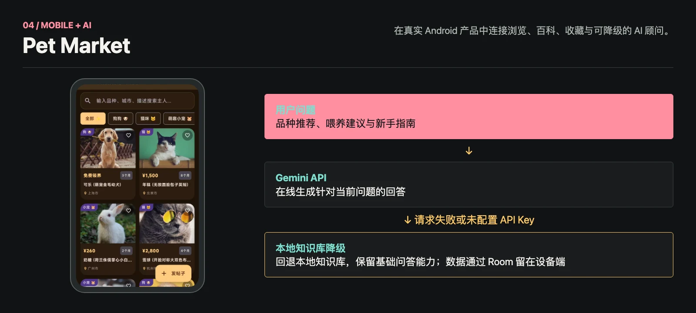
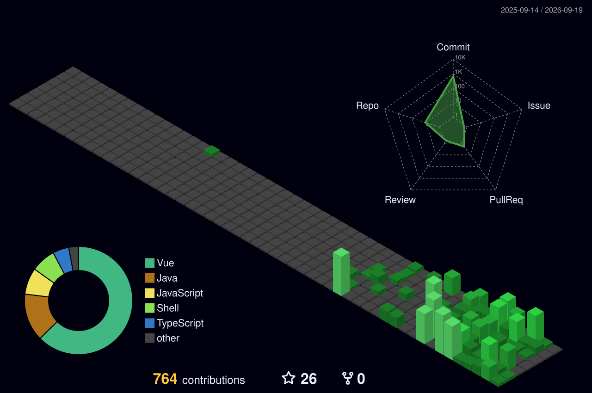

  

<h1 align="center">Aohs</h1>

<code>@qingzhizhu517-rgb</code>

  <strong>Engineering systems. Designing experiences.</strong> 
  把复杂需求做成真正可用的产品。

  <code>Java / 全栈产品开发 · AI 应用集成</code> 
  Shandong, China

  <a href="https://github.com/qingzhizhu517-rgb">GitHub</a> ·
  <a href="https://aohs.top/">Website</a> ·
  <a href="mailto:qingzhizhu517@gmail.com">Email</a>

## About / 关于

我是 Aohs，一名以 Java 为核心的全栈产品开发者。我喜欢把规则复杂的业务、富有表达力的交互，以及 AI 能力，收敛为可部署、可维护的真实产品。

## What I Build / 我解决的问题

### 01 / 业务系统

把复杂规则、数据导入、权限与审批流程整理成可以长期维护的系统。主要使用 `Java`、`Spring Boot`、`Vue`、`MySQL` 与 `Redis`。

### 02 / 交互产品

让内容不只被看见，也能被探索和操作。使用 `TypeScript`、`Next.js`、`Three.js`、`GSAP` 与 `Cloudflare` 构建响应式体验。

### 03 / 移动端与 AI 集成

把在线模型能力接入真实应用，同时设计本地存储与失败降级路径。主要使用 `Kotlin`、`Jetpack Compose`、`Room` 与 `Gemini API`。

## Selected Work / 精选项目

以下项目均由我独立设计与开发。每个项目展示的不是完整功能清单，而是最能说明问题与技术决策的部分。

### WFIT Workload

面向教学工作量核算的全流程业务系统。覆盖 G1-G11 共 11 类核算口径：G1-G6 与 G11 由策略引擎计算，G7/G10 自动汇总，G8/G9 支持教师申报，并连接排课 Excel 导入、三级审批、绩效酬金与报表导出。

  

`Java 17` · `Spring Boot` · `Vue 3` · `MySQL` · `Redis` · `Apache POI`

[查看仓库](https://github.com/qingzhizhu517-rgb/wfit--workload)

### Aohs Space

一个可交互的个人数字空间。它将 3D 工牌、流式动画、像素过渡、物理情绪墙和中英文内容组织在同一套 Next.js 应用中，并部署到 Cloudflare Workers。

  

`TypeScript` · `Next.js 15` · `React 19` · `Three.js` · `GSAP` · `Cloudflare Workers`

[在线访问](https://aohs.top/) · [查看仓库](https://github.com/qingzhizhu517-rgb/blog-t1)

### 黄河文学景观

围绕黄河流域山东段构建的数字人文与教学应用，连接地域城市、文学人物、诗文、景观、非遗、节气和交互式学习内容。仓库同时包含展示端、管理端、Spring Boot 后端与 React 数据可视化端。

  

`Java 17` · `Spring Boot 3.2` · `Vue 3` · `React 19` · `Three.js` · `GSAP` · `ECharts`

[查看仓库](https://github.com/qingzhizhu517-rgb/sjg)

### Pet Market

面向猫狗浏览与品种百科的 Android 应用，包含收藏、内容检索和 Gemini AI 顾问。在线请求不可用或未配置 API Key 时自动切换到本地知识库，保留基础问答能力。

  

`Kotlin` · `Jetpack Compose` · `Room` · `Retrofit` · `Gemini API`

[查看仓库](https://github.com/qingzhizhu517-rgb/pet-market)

## Toolbox / 技术坐标

**Core:** `Java` · `Spring Boot` · `Vue` · `TypeScript` · `MySQL` · `Redis`

**Product:** `Next.js` · `Three.js` · `GSAP` · `Cloudflare Workers`

**Mobile & AI:** `Kotlin` · `Jetpack Compose` · `Room` · `Gemini API`

**Currently exploring:** `Spring AI · RAG · LLM 应用架构`

## Contribution Lab

  

  <picture>
    <source media="(prefers-color-scheme: dark)" srcset="https://raw.githubusercontent.com/qingzhizhu517-rgb/qingzhizhu517-rgb/output/github-contribution-grid-snake-dark.svg">
    <source media="(prefers-color-scheme: light)" srcset="https://raw.githubusercontent.com/qingzhizhu517-rgb/qingzhizhu517-rgb/output/github-contribution-grid-snake.svg">
    
  </picture>

## Contact / 联系

欢迎交流 Java、全栈产品开发、交互体验与 AI 应用集成。

[GitHub](https://github.com/qingzhizhu517-rgb) · [aohs.top](https://aohs.top/) · [qingzhizhu517@gmail.com](mailto:qingzhizhu517@gmail.com)
