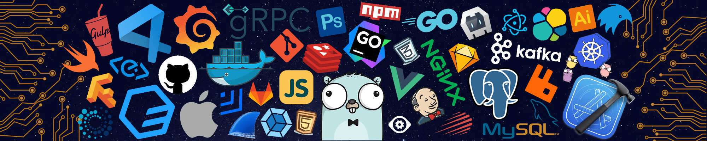

<p align="center">
<svg xmlns="http://www.w3.org/2000/svg" xmlns:xlink="http://www.w3.org/1999/xlink" style="z-index:1;position:relative" width="854" height="200" viewBox="0 0 854 200">
    <style>
        .text {
            font-size: 70px;
            font-weight: 700;
            font-family: -apple-system,BlinkMacSystemFont,Segoe UI,Helvetica,Arial,sans-serif,Apple Color Emoji,Segoe UI Emoji;
        }
        .desc {
            font-size: 20px;
            font-weight: 500;
            font-family: -apple-system,BlinkMacSystemFont,Segoe UI,Helvetica,Arial,sans-serif,Apple Color Emoji,Segoe UI Emoji;
        }
    </style>
    <g transform="translate(427, 100) scale(1, 1) translate(-427, -100)">
        <defs>
            <linearGradient id="linear" x1="0%" y1="0%" x2="100%" y2="0%">
                <stop offset="0%" stop-color="#B993D6"/><stop offset="100%" stop-color="#8CA6DB"/>
            </linearGradient>
        </defs>
        <path d="" fill="url(#linear)" opacity="0.4" >
            <animate attributeName="d" dur="20s" repeatCount="indefinite" keyTimes="0;0.333;0.667;1" calcMode="spline" keySplines="0.2 0 0.2 1;0.2 0 0.2 1;0.2 0 0.2 1" begin="0s" values="M0 0L 0 120Q 213.5 160 427 130T 854 155L 854 0 Z;M0 0L 0 145Q 213.5 160 427 140T 854 130L 854 0 Z;M0 0L 0 165Q 213.5 135 427 165T 854 130L 854 0 Z;M0 0L 0 120Q 213.5 160 427 130T 854 155L 854 0 Z"></animate>
        </path>
        <path d="" fill="url(#linear)" opacity="0.4" >
            <animate attributeName="d" dur="20s" repeatCount="indefinite" keyTimes="0;0.333;0.667;1" calcMode="spline" keySplines="0.2 0 0.2 1;0.2 0 0.2 1;0.2 0 0.2 1" begin="-10s" values="M0 0L 0 135Q 213.5 180 427 150T 854 160L 854 0 Z;M0 0L 0 150Q 213.5 120 427 120T 854 140L 854 0 Z;M0 0L 0 145Q 213.5 125 427 150T 854 165L 854 0 Z;M0 0L 0 135Q 213.5 180 427 150T 854 160L 854 0 Z"></animate>
        </path>
    </g>
    <text text-anchor="middle" alignment-baseline="middle" x="50%" y="30%" class="text" style="fill:#f7f5f5;" stroke="none" stroke-width="10">Welcome to my profile!</text>
</svg>
</p>

<p align="center">

</p>


<!--   my-kaggle     
### My achievements on [kaggle](https://www.kaggle.com/andrej0marinchenko):


-->


<!--   my-skils -->

| Property                                        | Data                                                                                                                                                                                                                                                                                                                                                                                                                                                                                                                                                                                                                                                                                                                                                                                                                                                                                                                                                                                                                                                                                                                                                                                                                                                                                                                                                                                                                                                                                                                                                                                                                                                                                                                                                                                                                                                                                                                                                                  |
|-------------------------------------------------|-----------------------------------------------------------------------------------------------------------------------------------------------------------------------------------------------------------------------------------------------------------------------------------------------------------------------------------------------------------------------------------------------------------------------------------------------------------------------------------------------------------------------------------------------------------------------------------------------------------------------------------------------------------------------------------------------------------------------------------------------------------------------------------------------------------------------------------------------------------------------------------------------------------------------------------------------------------------------------------------------------------------------------------------------------------------------------------------------------------------------------------------------------------------------------------------------------------------------------------------------------------------------------------------------------------------------------------------------------------------------------------------------------------------------------------------------------------------------------------------------------------------------------------------------------------------------------------------------------------------------------------------------------------------------------------------------------------------------------------------------------------------------------------------------------------------------------------------------------------------------------------------------------------------------------------------------------------------------|
| **Language / IDE**                              |     &nbsp; &nbsp; &nbsp; &nbsp;                                                                                                                                                                                                                                                                                                                                                                                                                                                                                                                                                                                                                                                                                                                                                                                                                                                                                                                                                                                                                                                                                                                                                                                                                                                                                                    |
| **Domain Knownledge**                           | [](https://github.com/BEPb/BEPb) [](https://github.com/search?q=user%3ABEPb&type=Repositories) [](https://github.com/search?q=user%3ABEPb&type=Repositories) [](https://github.com/search?q=user%3ABEPb&type=Repositories)                                                                                                                                                                                                                                                                                                                                                                                                                                                                                                                                                                                                                                                                                                                                                                                                                                                                                                                                                                                                                                                                                                                                                                                                                                            |
| **CI / CD**                                     | [](https://github.com/BEPb/BEPb) &nbsp; &nbsp; &nbsp;  [](https://www.docker.com) [](https://www.jetbrains.com/pycharm/) [](https://code.visualstudio.com)|
| **Databases**                                   | &nbsp; &nbsp; [](https://www.postgresql.org)                                                                                                                                                                                                                                                                                                                                                                                                                                                                                                                                                                                                                                                                                                                                                                                                                                                                                                                                                                                                                                                                                                                                                                                                                                                                                                                                                                                                                                                                                                                                                                                                                                                                                                                                                                                                 |
| **Machine Learning / Deep Learning frameworks** | ![Jupyter Notebook](http://img.shields.io/badge/-Jupyter%20Notebook-eee?style=flat-square&logo=data:image/png;base64,iVBORw0KGgoAAAANSUhEUgAAAA4AAAAQCAMAAAARSr4IAAACGVBMVEVhYmJdYWT/fBfzdyaqdlV2dnfcdC9udnz5dyKUaU3wdicCO2CzZzVdUkpOTk5MTk60ZzUAAP/XcC3fcivgciv/lArAajLqdSifYjrydyajnJjEjWifnp3FjGcAAACenp52dnd2dnd2dndhYmJhYmIxW3bzdybzdybzdybzdybzdyb/dxpydnl2dnd2dndhYmJgYmOda0r0dyXzdybzdybzdybudymQdmZldoJQYGmRaU7ydyfzdybzdybzdybzdybzdybzdybzdyb1dyX9dx/2dyXzdybzdybzdyb+eiPzdybzdybzdyb/ghz8eSQ3SFT/tABNTk5HTFBMTk5OTk5OTk5OTk5OTk5OTk5OTk5OTk5OTk5NTk5GTFBOTk5OTk5OTk5OTk5OTk5OTk5OTk5OTk5OTk5OTk5OTk5OTk5OTk5OTk5OTk5NTk5OTk5OTk5OTk5OTk5OTk5OTk5OTk5OTk5NTk5NTk5UUEx5WUMAOGRMTU9OTk5OTk5OTk5OTk5OTk5FTFAXQFvBajK8aTP2eCX0dyb0dyb0dybzdyb4eCXzdybzdybzdybzdybzdybzdybzdybzdybzdyb6dB3zdyXzdybzdybzdybzdybzdybzdybzdyaenp6cn6HKimD0dyXzdybzdybzdybzdybzdybzdyaenp6enp6dn6Dzdybzdyaenp6enp6enp6enp7zdyaenp7///9F1GYlAAAAsHRSTlMAAAAAAAAAAAAAAAAAAAAAAAAAAAAAAAAAAAAAAAAAADHCVho4Ax1RcnFOFz/ibFmwHXPc/thwKwkKJpfbqn1oaX+uighRdSIDAyV6TAQcAgIVHBMbKjIgEzBTHCsbLUBdQlhiTWBlR1xkaEVIR1tPbFEvF0pJNR9AFAQIMwgfKQUDBwgDBEsuMkcCLLSUKBsqT5iwNcX47N/g7cAxPmUqZq/OzaxiExPJYgQPCJjcP9lVnrgAAAClSURBVAjXVcyxSoIBAEXh+xkhEkFr6hD0AM5BkbQ3ODaEY4uDSENCS1BThI/h4v4TERG0NzZHvoAQ0SDV8FvkmS6cw5UgSTR5s83rlgUvWuA8l/Bs59eYbXhS28VdUt1H4dA9Eu1HexUdS3T/7Y81vXJ9rQicLcxoAK64hvd1fWwOeDgoy+JW3bCs56tOonnxd3ycGKt9nt7I91GShgn60yRJI/kBP8EfEEdOa6sAAAAASUVORK5CYII=&logoColor=F37626)    &nbsp; &nbsp; |


<!--   GitHub stats graph -->
**📫 How to Reach me:**
<p align="left">
<a href="https://twitter.com/noname85071193" target="blank"></a>
<a href="https://linkedin.com/in/andrej-marinchenko-0445b7214" target="blank"></a>
<a href="mailto:andrej.marinchenko@gmail.com" target="blank"></a>
<a href="https://api.whatsapp.com/send?phone=+375333333355" alt="Connect on Whatsapp">  </a>
</p>


   <!--machine-learning-->
```mermaid
graph TD;
    machine-learning-->Data;
    machine-learning-->Algorithms;
    machine-learning-->Statistical-Models;
    machine-learning-->Feature-Engineering;
    machine-learning-->Evaluation-Metrics;
    machine-learning-->Deployment;
   ```
   
 


<div align="center">
<summary>Trophy: Hackerrank Profile Trophy</summary>
</div>

<p align="center"> 

 

</p>


<!-- Belarus - My Home-->
  
 ```geojson
{
 "type": "FeatureCollection",
 "features": [
   {
     "type": "Feature",
     "id": 1,
     "properties": {
       "ID": 0
     },
     "geometry": {
       "type": "Polygon",
       "coordinates": [
         [
             [23.5,53.9],
             [32.6,52.6]
         ]
       ]
     }
   }
 ]
}

```


#### Thanks for visiting :heart:

<p align="center"> 
  

counting of visitors to this page in this section started from May 8, 2022
<a href="http://s01.flagcounter.com/more/ap7"></a>


### Profile Views
counting of visitors to this page in this section started from June 12, 2022


</br>

[MIT](LICENSE)


</p>

---
  *If you liked my profile, you can Star ⭐ the repo and if you want to use this template you can Fork it and can use.* 
---
Would you ike to meet me?

If you want to contribute to any of my repositories, feel free to submit PRs, issues and email me. Pick a slot if you'd like to meet me and chat about proposals and ideas - but make sure to describe the agenda

---
  *I use an automatic subscription control system. Thus, everyone who subscribes to me, I will subscribe to those and I will respond, and vice versa, I will remove all those who unsubscribe from me from among those who should be followed.* 
---

[for the future hacker...](https://referral.hackthebox.com/mz8gTFM)

