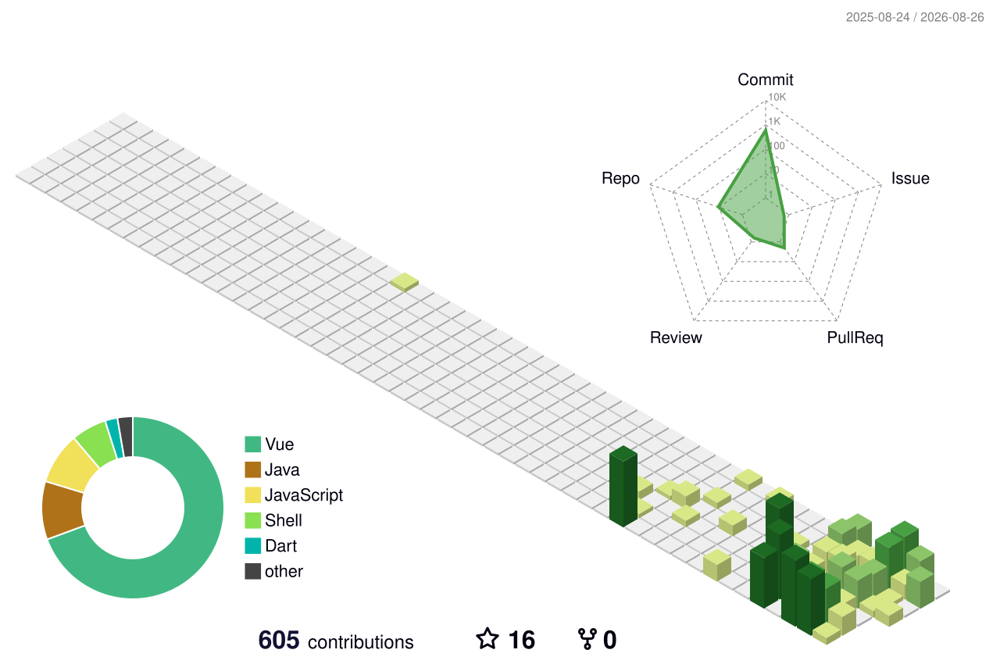

<p align="center">
<svg xmlns="http://www.w3.org/2000/svg" xmlns:xlink="http://www.w3.org/1999/xlink" style="z-index:1;position:relative" width="854" height="200" viewBox="0 0 854 200">
    <style>
        .text {
            font-size: 70px;
            font-weight: 700;
            font-family: -apple-system,BlinkMacSystemFont,Segoe UI,Helvetica,Arial,sans-serif,Apple Color Emoji,Segoe UI Emoji;
        }
        .desc {
            font-size: 20px;
            font-weight: 500;
            font-family: -apple-system,BlinkMacSystemFont,Segoe UI,Helvetica,Arial,sans-serif,Apple Color Emoji,Segoe UI Emoji;
        }
    </style>
    <g transform="translate(427, 100) scale(1, 1) translate(-427, -100)">
        <defs>
            <linearGradient id="linear" x1="0%" y1="0%" x2="100%" y2="0%">
                <stop offset="0%" stop-color="#B993D6"/><stop offset="100%" stop-color="#8CA6DB"/>
            </linearGradient>
        </defs>
        <path d="" fill="url(#linear)" opacity="0.4" >
            <animate attributeName="d" dur="20s" repeatCount="indefinite" keyTimes="0;0.333;0.667;1" calcMode="spline" keySplines="0.2 0 0.2 1;0.2 0 0.2 1;0.2 0 0.2 1" begin="0s" values="M0 0L 0 120Q 213.5 160 427 130T 854 155L 854 0 Z;M0 0L 0 145Q 213.5 160 427 140T 854 130L 854 0 Z;M0 0L 0 165Q 213.5 135 427 165T 854 130L 854 0 Z;M0 0L 0 120Q 213.5 160 427 130T 854 155L 854 0 Z"></animate>
        </path>
        <path d="" fill="url(#linear)" opacity="0.4" >
            <animate attributeName="d" dur="20s" repeatCount="indefinite" keyTimes="0;0.333;0.667;1" calcMode="spline" keySplines="0.2 0 0.2 1;0.2 0 0.2 1;0.2 0 0.2 1" begin="-10s" values="M0 0L 0 135Q 213.5 180 427 150T 854 160L 854 0 Z;M0 0L 0 150Q 213.5 120 427 120T 854 140L 854 0 Z;M0 0L 0 145Q 213.5 125 427 150T 854 165L 854 0 Z;M0 0L 0 135Q 213.5 180 427 150T 854 160L 854 0 Z"></animate>
        </path>
    </g>
    <text text-anchor="middle" alignment-baseline="middle" x="50%" y="30%" class="text" style="fill:#f7f5f5;" stroke="none" stroke-width="10">Welcome to my profile!</text>
</svg>
</p>

<p align="center">

</p>

<div align="center">

# 👋 Hi, I'm **qz-zhu** (qingzhizhu517-rgb)

### ☕ Java & AI Agent Engineer | Focusing on Spring AI, RAG & LLM

📍 Shandong, China

</div>

---

## 🎯 About Me

```java
public class QzZhu {
    private String role = "Java & AI Agent Engineer";
    private String[] interests = {"Spring AI", "RAG", "LLM", "Open Source"};
    private String location = "Shandong, China";

    public void sayHello() {
        System.out.println("Welcome to my GitHub profile! 🚀");
    }
}
```

---

## 🛠️ Tech Stack

<table>
  <tr>
    <td><strong>Language / IDE</strong></td>
    <td>
      
      
      
      
      
    </td>
  </tr>
  <tr>
    <td><strong>AI / ML Frameworks</strong></td>
    <td>
      
      
      
      
      
    </td>
  </tr>
  <tr>
    <td><strong>Backend / Database</strong></td>
    <td>
      
      
      
      
    </td>
  </tr>
  <tr>
    <td><strong>DevOps / Tools</strong></td>
    <td>
      
      
      
      
      
    </td>
  </tr>
</table>

---

## 🎨 3D Contribution Graph

<div align="center">

### 🌟 3D Profile Contribution


</div>

---

## 🔥 Recent Activity

<!--START_SECTION:activity-->
1. 🎉 Joined GitHub
<!--END_SECTION:activity-->

---

## 📫 How to Reach Me

<div align="center">

<!-- 联系方式徽章 -->
<a href="https://github.com/qingzhizhu517-rgb">
  
</a>
<a href="mailto:your-email@example.com">
  
</a>
<a href="https://linkedin.com/in/your-linkedin">
  
</a>

</div>

---

## 💡 Fun Fact

<div align="center">

```javascript
while (true) {
    coffee.drink();
    code.write();
    bugs.fix();
    repeat();
}
```

</div>

---

## 📊 Visitor Count

<div align="center">

<!-- 访客计数器 -->


<p>Counting of visitors started from July 2026</p>

</div>

---

---

<div align="center">

### ⭐ If you like my profile, give it a star! ⭐


</div>